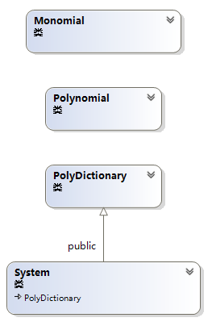
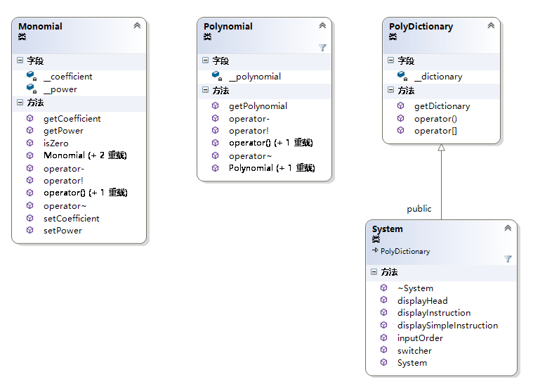
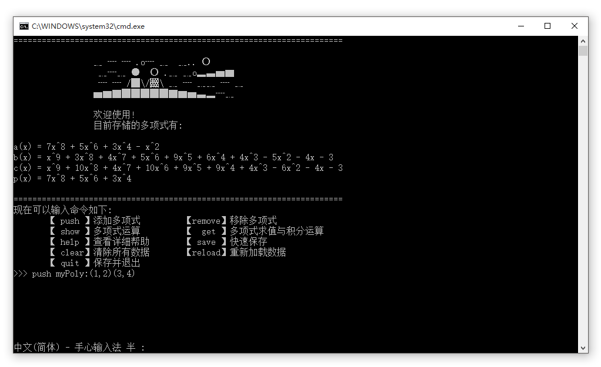
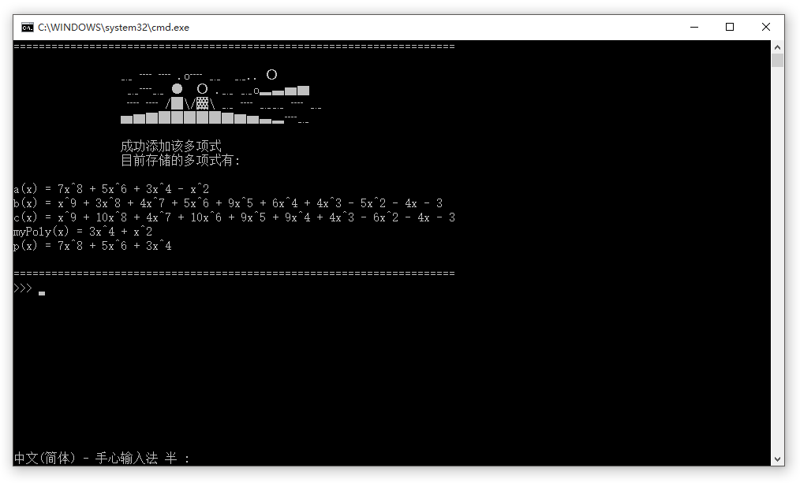
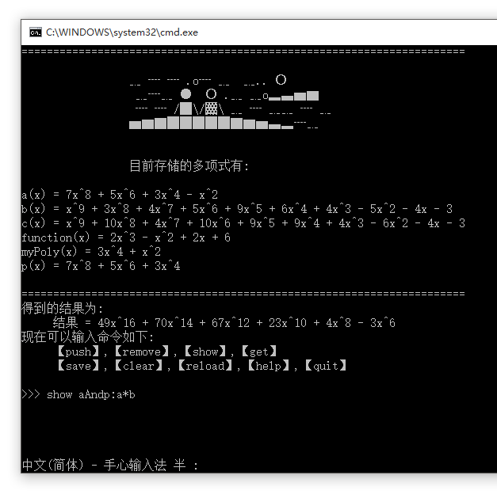
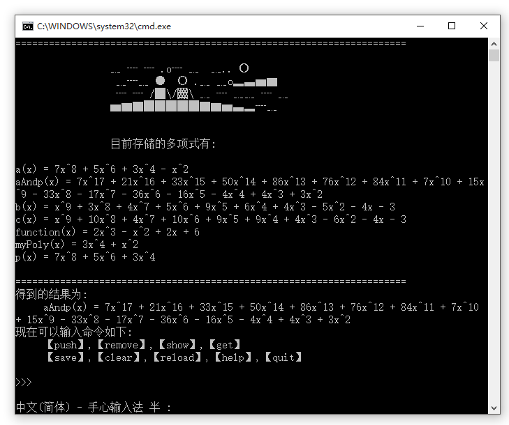

# 实验报告

- 教务二班
- Zhiyu He
- 15331097

[这个多项式项目的Github](https://github.com/HeskeyBaozi/PolyCaculator)


## 零. 成品

#### 友好的界面


#### 求导运算
敲入命令:
```
show n2': !n2
```


#### 定积分运算
敲入命令:
```
get n2(0,5)
```


#### help功能
敲入命令:
```
help
```


#### clear功能
敲入命令:
```
clear
```


## 一. 实验目的
- 运算符重载
- 面向对象编程思想: 封装, 继承, 多态
- 代码重构能力

## 二. 实验环境
- Operation System: Win10 x64

### 编程语言和开发工具
- 编程语言： C++(11)
- IDE: Visual Studio 2015, JetBrains CLion 2016.1.1

## 三．实验内容

设计并实现一个多项式计算器

## 四.分析与设计

### 需求分析：

#### 要求

- 多项式的保存, 读取, 表示
- 多项式加法, 减法运算, 求值运算
- 界面友好, 代码复用性

#### 已实现的要求

- 多项式的保存, 读取, 表示
- 多项式加法, 减法, 乘法, 不定积分运算
- 多项式求值, 定积分运算
- 界面友好, 扩展性强, 可读性强

### 类结构设计



### 细节设计

#### 主要细节
下面图片没有显示私有方法


## 五、实验结果

#### 添加多项式

##### 敲入`push`命令


##### 回车, 显示结果


#### 多项式加法

##### 敲入`show`命令
```
show a+b
```
命令表示计算a+b并显示结果, (a,b各代表一个多项式)


##### 回车, 显示结果


#### 多项式乘法

##### 敲入`show`命令
```
show aAndp:a*p
```
命令表示计算a*p并显示结果, 并将这个结果得到的多项式以名字`aAndp`储存起来, (a,p各代表一个多项式)


##### 回车, 显示结果


#### 多项式定积分运算

##### 敲入`get`命令
```
get function(0,10)
```
命令表示计算`function`这个多项式从0积分到10的定积分


##### 回车, 显示结果


## 六、设计心得

获取的最大的新的就是: **抽象**
> 软件开发中遇到的所有问题,都可以通过增加一层抽象而得以解决

其中标准算法库中`std::sort()`作为高阶函数可以使用`lambda`表达式也给我进行了函数式编程的启蒙
